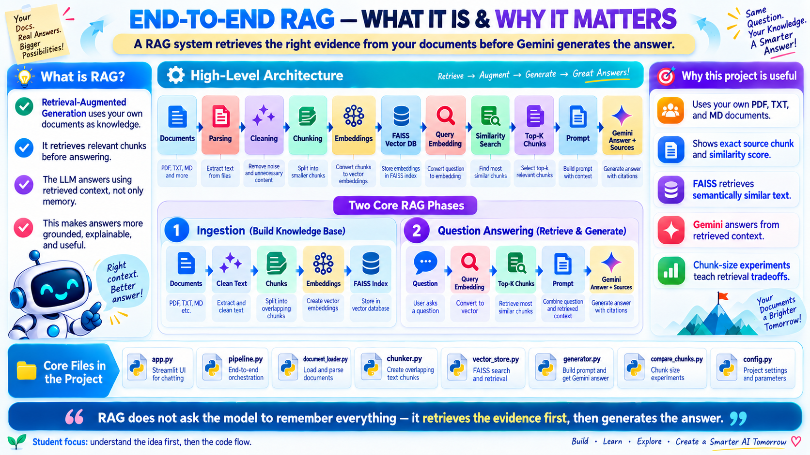
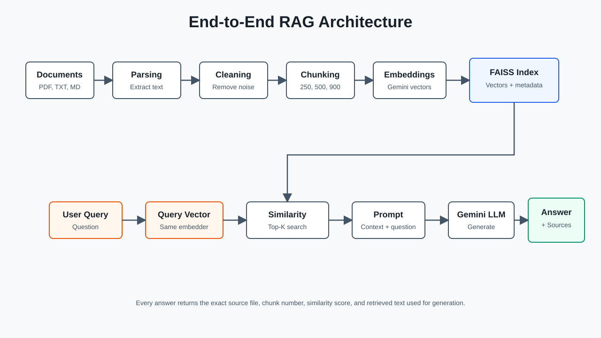
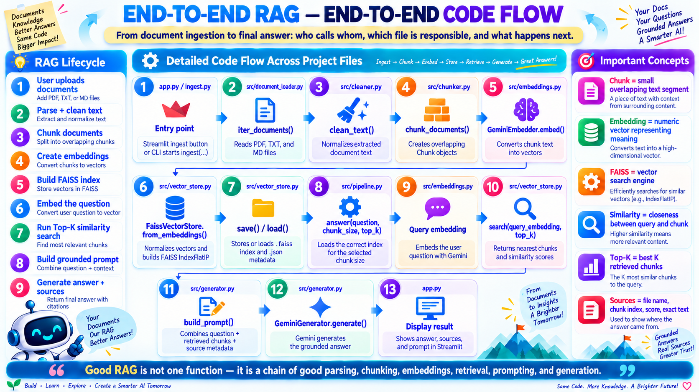
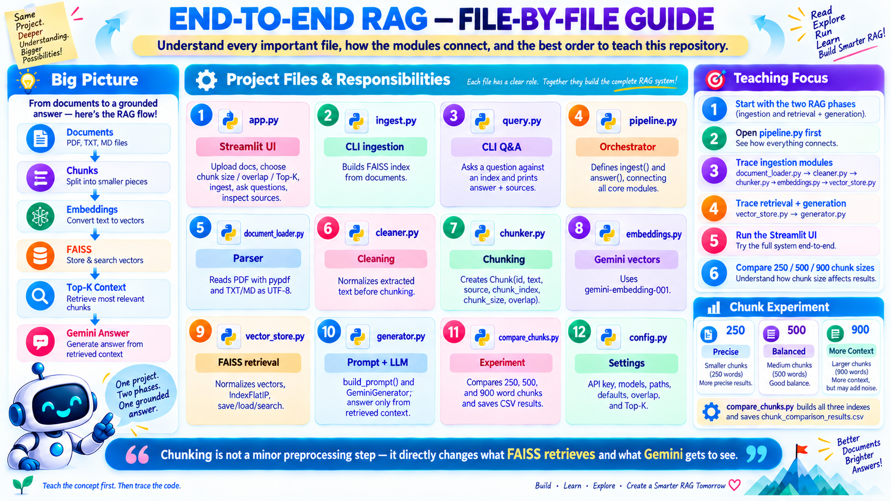

# End-to-End RAG Application

A complete Retrieval-Augmented Generation (RAG) application that turns PDF, TXT, and Markdown documents into a searchable knowledge base. It retrieves the most relevant passages for a question, sends only that grounded context to Gemini, and returns an answer together with the exact source chunks used.

The project provides three ways to explore the workflow:

- a **Streamlit web application** for uploading documents, indexing them, and asking questions;
- **command-line tools** for ingestion and question answering; and
- a **chunk-size experiment** that compares retrieval with 250, 500, and 900-word chunks.

> The application makes live Google Gemini API calls. It has no mock or demo fallback, so a valid `GOOGLE_API_KEY` and an internet connection are required for ingestion, querying, and model verification.

## RAG at a Glance

The diagram below introduces the complete idea: documents are processed into vector embeddings during ingestion; later, a user question is embedded and matched against those vectors before Gemini writes a grounded answer.



In short:

```text
Documents -> Parse -> Clean -> Chunk -> Embed -> FAISS index
Question  -> Embed -> Search -> Top-K chunks -> Prompt -> Gemini -> Answer + sources
```

## Architecture and Application Flow



The system has two distinct phases.

### 1. Ingestion: build the knowledge base

1. `app.py` or `ingest.py` calls `src.pipeline.ingest()`.
2. `src.document_loader.iter_documents()` recursively finds supported files and extracts their text. TXT and MD files are read as UTF-8; PDFs are parsed with `pypdf`.
3. `src.cleaner.clean_text()` removes null bytes, repeated horizontal whitespace, excess blank lines, and surrounding line whitespace.
4. `src.chunker.chunk_documents()` splits each document into overlapping word-based chunks. Every chunk retains its source path, index, size, and overlap.
5. `src.embeddings.GeminiEmbedder` sends the chunk text to the configured Gemini embedding model.
6. `src.vector_store.FaissVectorStore` L2-normalizes the vectors and stores them in a FAISS `IndexFlatIP`. With normalized vectors, inner product acts as cosine similarity.
7. The index is written to `indexes/rag_chunks_<size>.faiss`, while chunk text and provenance are written to the matching `.json` file.

### 2. Question answering: retrieve and generate

1. `app.py` or `query.py` calls `src.pipeline.answer()` with a question, chunk size, and Top-K value.
2. The pipeline loads the FAISS index and JSON metadata for the selected chunk size.
3. The question is embedded with the same Gemini embedding model used during ingestion.
4. FAISS returns the Top-K chunks with the highest similarity scores.
5. `src.generator.build_prompt()` combines the question with the retrieved text, source paths, chunk numbers, and scores.
6. `GeminiGenerator.generate()` asks the configured Gemini generation model to answer only from that context and cite its sources.
7. The UI or CLI displays the generated answer. The Streamlit UI also exposes the retrieved text and complete prompt for inspection.

The following guide maps that runtime sequence to the exact functions and files in the repository:



For an editable Mermaid version of the architecture, see [docs/architecture.md](docs/architecture.md).

## Project Structure

```text
.
├── app.py                          # Streamlit upload, ingestion, and Q&A UI
├── ingest.py                       # CLI entry point for building an index
├── query.py                        # CLI entry point for asking one question
├── compare_chunks.py               # Builds and compares multiple chunk-size indexes
├── verify_llm.py                   # Makes a minimal live Gemini generation request
├── requirements.txt                # Python runtime dependencies
├── .env.example                    # Safe environment-variable template
├── data/
│   └── sample_docs/                # Included PDF and Markdown demonstration corpus
├── docs/
│   ├── architecture.md             # Mermaid architecture source
│   ├── architecture_diagram.svg    # Embeddable architecture image
│   ├── images/                     # Illustrated project and flow guides
│   └── video_script.md             # Suggested demonstration walkthrough
├── src/
│   ├── config.py                   # Environment-backed settings
│   ├── document_loader.py          # PDF, TXT, and MD parsing
│   ├── cleaner.py                  # Extracted-text normalization
│   ├── chunker.py                  # Overlapping word chunks and metadata
│   ├── embeddings.py               # Gemini document/query embeddings
│   ├── vector_store.py             # FAISS creation, persistence, and search
│   ├── generator.py                # Grounded prompt and Gemini generation
│   └── pipeline.py                 # End-to-end ingest() and answer() orchestration
└── tests/
    └── test_chunker.py             # Chunk overlap, metadata, and validation tests
```

This visual file guide explains how each main module contributes to the application:



## Requirements

### System requirements

- **Python 3.10 or newer** (the code uses modern type-union syntax)
- `pip` and Python virtual-environment support
- a valid **Google Gemini API key**
- internet access for Gemini embedding and generation requests
- local disk space for the FAISS index and JSON metadata

FAISS CPU wheels may not be available for every Python version or platform. If `faiss-cpu` fails to install, use a commonly supported 64-bit CPython release in a fresh virtual environment.

### Python packages

All packages are declared in `requirements.txt`:

| Package | Minimum version | Purpose |
| --- | ---: | --- |
| `google-genai` | 1.30.0 | Gemini embeddings and answer generation |
| `streamlit` | 1.37.0 | Interactive web UI |
| `faiss-cpu` | 1.8.0 | Local vector indexing and similarity search |
| `numpy` | 1.26.0 | Vector conversion and normalization |
| `pandas` | 2.2.0 | Chunk-comparison CSV output |
| `pypdf` | 4.3.0 | PDF text extraction |
| `python-dotenv` | 1.0.1 | Loads configuration from `.env` |
| `rich` | 13.7.1 | Formatted CLI tables and messages |

## Installation and Configuration

### 1. Create and activate a virtual environment

macOS or Linux:

```bash
python3 -m venv .venv
source .venv/bin/activate
```

Windows PowerShell:

```powershell
py -m venv .venv
.venv\Scripts\Activate.ps1
```

### 2. Install dependencies

```bash
python -m pip install --upgrade pip
python -m pip install -r requirements.txt
```

### 3. Create `.env`

macOS, Linux, or Git Bash:

```bash
cp .env.example .env
```

Windows Command Prompt:

```bat
copy .env.example .env
```

Then add your API key to `.env`:

```dotenv
GOOGLE_API_KEY=your_google_api_key
GENERATION_MODEL=gemini-3.5-flash-lite
EMBEDDING_MODEL=gemini-embedding-001
```

Do not commit `.env`; it is intentionally ignored by Git.

### Configuration reference

Only `GOOGLE_API_KEY` is required. The remaining values have defaults in `src/config.py` and can be overridden through `.env` or the process environment.

| Variable | Default | Meaning |
| --- | --- | --- |
| `GOOGLE_API_KEY` | none | Credential used for live Gemini calls |
| `GENERATION_MODEL` | `gemini-3.5-flash-lite` | Model that writes the final answer |
| `EMBEDDING_MODEL` | `gemini-embedding-001` | Model used for document and query vectors |
| `DATA_DIR` | `data/sample_docs` | Default corpus used by CLI ingestion |
| `INDEX_DIR` | `indexes` | Location of generated FAISS and metadata files |
| `CHUNK_SIZE` | `500` | Default maximum words per chunk |
| `CHUNK_OVERLAP` | `80` | Words repeated between adjacent chunks |
| `TOP_K` | `4` | Default number of chunks retrieved per question |

The embedding model must remain the same when building and querying an index; otherwise vector dimensions or semantic behavior may be incompatible. If you change it, rebuild the indexes.

### 4. Verify the live model connection

```bash
python verify_llm.py
```

Success prints a response from the configured generation model. The program stops with a clear error if the API key is missing, the model name appears to be a mock/test model, or Gemini returns no text.

## Running the Application

### Option A: Streamlit web interface

Start the UI from the repository root:

```bash
streamlit run app.py
```

Then:

1. Upload one or more PDF, TXT, or MD files in the sidebar.
2. Select a chunk size and overlap.
3. Click **Ingest uploaded documents** and wait for the index to be created.
4. Choose how many chunks to retrieve with **Top-K chunks**.
5. Enter a question and click **Ask**.
6. Read the answer, then expand each source panel to inspect its file, chunk number, similarity score, and exact text.
7. Expand **Prompt sent to Gemini** to see precisely what grounded context the model received.

Uploaded files are isolated under `data/uploaded_docs/<session-id>/`. Their indexes are saved by chunk size under `indexes/`; ingest again after changing the selected chunk size or document set. Because an index filename contains only the chunk size, a later ingestion using the same size replaces that size's previous index.

### Option B: command-line workflow

Build an index from the included sample documents:

```bash
python ingest.py --data-dir data/sample_docs --chunk-size 500 --overlap 80
```

Ask a question against that index:

```bash
python query.py "What are the main stages in a RAG pipeline?" --chunk-size 500 --top-k 4
```

The `--chunk-size` supplied to `query.py` selects an existing index; it does not create one. Run `ingest.py` with the same size first.

Useful demonstration questions include:

- `What problem does retrieval-augmented generation try to solve?`
- `How does RAG combine parametric and non-parametric memory?`
- `Why is returning provenance important in a RAG system?`
- `What are the tradeoffs between small and large chunks?`

## Chunk-Size Experiment

Run the included retrieval comparison:

```bash
python compare_chunks.py --question "What are the main stages in a RAG pipeline?"
```

By default, the script builds separate 250, 500, and 900-word indexes, retrieves three results from each, prints a comparison table, and writes:

```text
chunk_comparison_results.csv
```

General interpretation:

| Chunk size | Typical strength | Typical tradeoff |
| --- | --- | --- |
| 250 words | Focused, precise retrieval | May split related context across chunks |
| 500 words | Balanced context and precision | A middle-ground default, not optimal for every corpus |
| 900 words | More surrounding context | Can introduce unrelated text and use more prompt space |

These are expectations, not guaranteed results. Use the generated scores, previews, and answer quality to evaluate the best setting for your own documents.

## Generated Data and Source Traceability

Each ingestion run creates two matching files:

```text
indexes/rag_chunks_500.faiss  # normalized vectors and FAISS search structure
indexes/rag_chunks_500.json   # chunk text, source, index, size, and overlap
```

The JSON metadata allows every FAISS result to be mapped back to its original source. Each returned source contains:

- `source`: original file path;
- `chunk_index`: zero-based position within that file;
- `chunk_size`: configured maximum number of words;
- `similarity`: normalized inner-product score; and
- `text`: exact content supplied to the generation prompt.

Generated indexes, uploaded documents, comparison CSV output, and API responses may contain sensitive document content. Review your data-handling requirements before using private material, and do not commit generated artifacts unless you intend to publish them.

## Tests

Run the unit tests from the repository root:

```bash
python -m unittest discover -s tests
```

The current tests verify overlapping word chunks, stored metadata, and invalid overlap handling. They do not make network calls. For a live generation smoke test, run `python verify_llm.py` separately.

## Common Errors

| Error or symptom | Likely cause | Resolution |
| --- | --- | --- |
| `GOOGLE_API_KEY is missing` | `.env` is absent or empty | Copy `.env.example`, add the key, and restart the process |
| FAISS or JSON file not found | No index exists for the requested chunk size | Run ingestion with that exact `--chunk-size` first |
| `overlap must be ... smaller than chunk_size` | Invalid chunk parameters | Set overlap to a value from `0` through `chunk_size - 1` |
| Empty or weak PDF text | The PDF contains scanned images or difficult layout | Apply OCR externally or provide a text/Markdown version |
| Import/module errors | Command was run outside the repository or wrong environment | Activate `.venv` and run commands from the repository root |
| Model/API error | Invalid key, unavailable model, quota, or network issue | Check the key, model names, account quota, and connectivity |

## Demonstration and Submission

### Video explanation

Watch the complete YouTube walkthrough for an explanation of the project architecture, application flow, and RAG workflow:

[](https://www.youtube.com/watch?v=wF6O563M3h4)

**[Watch the End-to-End RAG explanation on YouTube](https://www.youtube.com/watch?v=wF6O563M3h4)**

Use [docs/video_script.md](docs/video_script.md) as a walkthrough outline. A complete demonstration should show document parsing, cleaning, chunking, embeddings, persisted FAISS files, query embedding, Top-K retrieval, prompt construction, the generated answer, returned sources, and chunk-size comparison results.

When submitting the repository, share the exact GitHub folder or repository URL and confirm that `.env` is not included.
