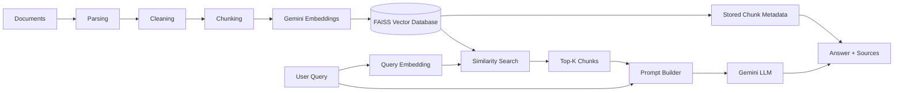

# RAG Architecture

```mermaid
flowchart LR
    A[Documents] --> B[Parsing]
    B --> C[Cleaning]
    C --> D[Chunking]
    D --> E[Gemini Embeddings]
    E --> F[(FAISS Vector Database)]
    F --> G[Stored Chunk Metadata]

    H[User Query] --> I[Query Embedding]
    I --> J[Similarity Search]
    F --> J
    J --> K[Top-K Chunks]
    K --> L[Prompt Builder]
    H --> L
    L --> M[Gemini LLM]
    M --> N[Answer + Sources]
    G --> N
```
